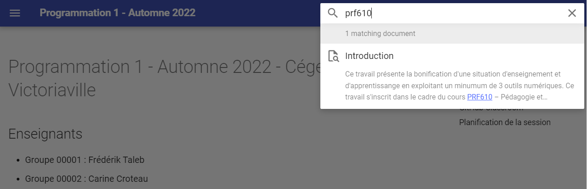
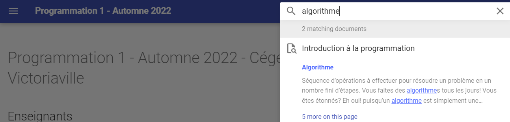
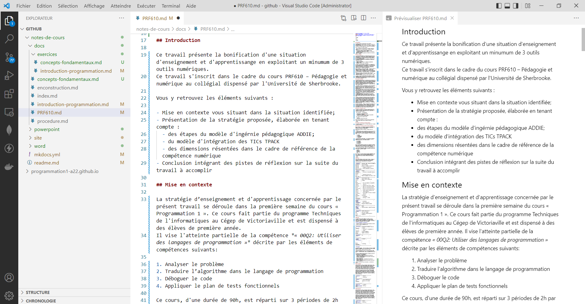
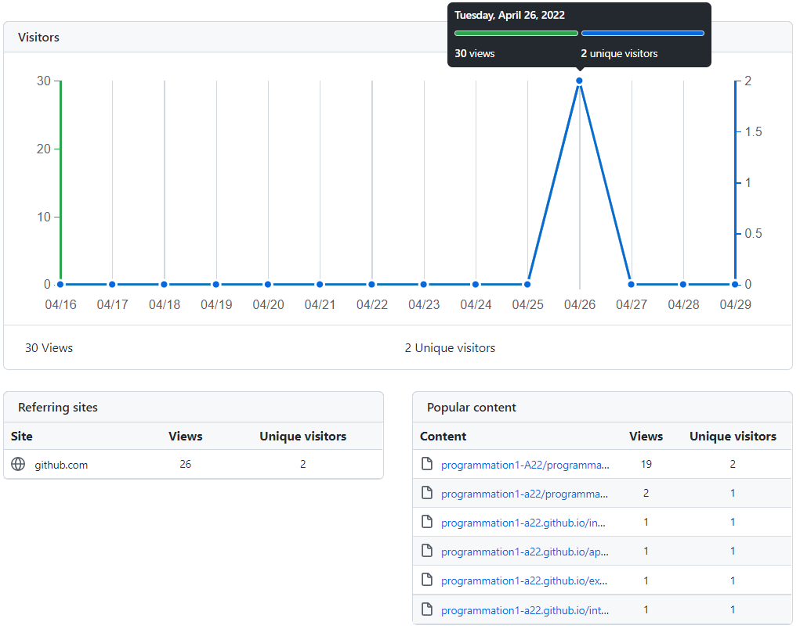
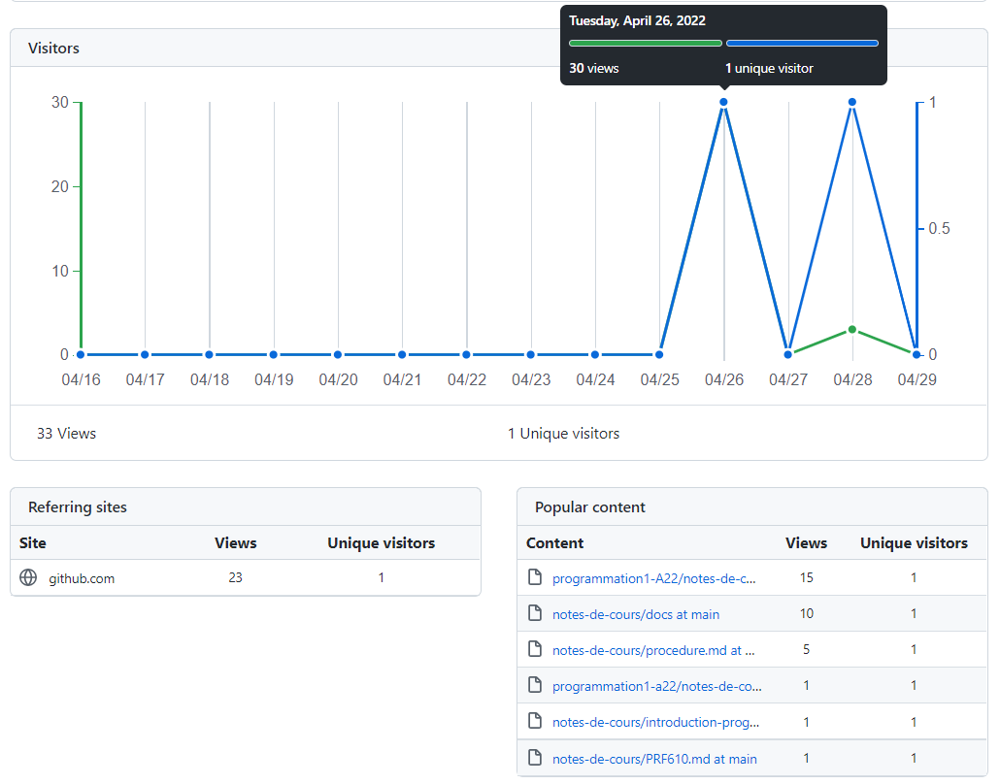
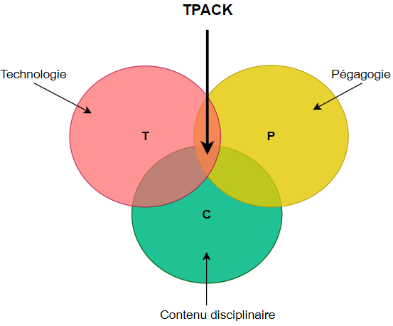

\newpage

\toc

\newpage

## Introduction

Ce travail présente la bonification d'une situation d'enseignement et d'apprentissange en exploitant un minumum de 3 outils numériques. Il s'inscrit dans le cadre du cours PRF610 – Pédagogie et numérique au collégial dispensé par l'Université de Sherbrooke. 

Vous y retrouvez les éléments suivants :

-	Mise en contexte vous situant dans la situation identifiée;
-	Présentation de la stratégie élaborée selon le modèle d'ingérnie pédagogique ADDIE;
- Évaluation critique de la solution proposée en fonction :
  - du modèle d'intégration des TICs TPACK;
  - de la pédagogie inclusive;
  - des dimensions identifiées dans le Cadre de référence de la compétence numérique;
  - du point de vue organisationnel dans la tâche enseignante.
- Présentation des limitations observées lors de la mise en oeuvre du prototype;
- Conclusion.

## Mise en contexte

La stratégie d’enseignement et d'apprentissage concernée par le présent travail se déroule dans la première semaine du cours *« Programmation 1 »*. Ce cours fait partie du programme Techniques de l'informatiques au Cégep de Victoriaville et est dispensé à des élèves de première année. 
Il vise l'atteinte partielle de la compétence *« 00Q2: Utiliser des langages de programmation »* décrite par les éléments de compétences suivants:

1. Analyser le problème
2. Traduire l’algorithme dans le langage de programmation
3. Déboguer le code
4. Appliquer le plan de tests fonctionnels

Ce cours, d'une durée de 90h, est réparti sur 3 périodes de 2h par semaine, pour une durée de 15 semaines. On y introduit les notions fondamentales de la programmation. La cible de formation du cours est la suivante: *À la fin du cours, l'élève sera capable de résoudre des problèmes simples en traduisant des algorithmes dans un langage de programmation.*

Dans sa pratique, l'élève sera aussi amené à utiliser un outil de gestion des versions du code qu'il produit. L'outil le plus répandu en ce moment est GitHub. Cet outil s'intègre dans l'ensemble des cours du programme afin d'assurer une excellente maîtrise de l'outil à sa diplômation. Dans le cours Programmation 1, il est attendu que l'élève soit en mesure, à la fin du cours, de:

* Récupérer et clôner un dépôt distant (remote repository);
* Porter des amélioration au code présent dans le dépôt à l'aide d'algorithmes simples;
* Publier sa version du code dans un dépôt personnel en ligne.

Ce travail s'inspire du guide CAAP afin de repenser le contexte pédagogique global du cours afin que les outils TICs utilisés s'hamonisent le plus fidèlement avec les contenus disciplinaires et les méthodes pédagogiques ciblés. 

### Éléments déclencheurs

Les deux dernières années ont été marquées par la sélection de la plateforme pédagogique Teams en tant que plateforme officielle au Cégep de Victoriaville, afin de diminuer le nombre de plateformes proposées aux élèves. Cela a mené à une réorganisation partielle des contenus pédagogiques aparavants publiés dans Google Classroom.Mon collègue et moi qui avons enseigné *Programmation 1* à l'automne 2021, avons établi certains constats: 

* Les groupes étaient sont hétérogènes et l'écart est de plus en plus marqué. Les élèves présentant des difficultés en début de session n'ont pas réussi à rattraper leurs acquis et plusieurs ont échoué le cours. Nous devrons revoir nos stratégies pédagogiques pour aider les élèves ayant de plus grands besoins que par le passé;
* Les élèves consultent très peu les notes de cours que l'on a publié alors que c'était pour nous des outils essentiels afin de leur permettre de réviser la matière enseignée; Ils semblent avoir de la difficulté à retrouver l'informations recherchée; 
* La majorité élèves n'ont pas développé les habileltés ciblées dans leur utilisation de l'outil de gestion de versions de code GitHub.
* L'approche pédagogique utilisée propose aux élèves des stratégies apprentissages indivuelles et nous croyons que le co-développement, une fois les concepts de base établis, permettrait une plus grande acquisition des habiletés ciblées dans le cours. 

J'ai aussi l'impression d'éparpiller mon cours dans plusieurs plateformes. Mes notes de cours étaient publiées sur Teams, alors que l'acquisition de certaines habiletés avec la gestion de versions invitaient les élèves à utiliser GitHub Classroom, qui est aussi une plate-forme pédagogique. Les élèves devaient également utiliser un environnement de développement pour programmer. À certains moments de la session, j'ai senti que, malgré une excellente habileté à manipuler les technologies présentées, les élèves avaient de la difficulté à s'y retrouver parmi tous ces outils. 

Ce travail vise ainsi à repenser l'organisation du contenu et les activités d'aprentissage. L'objectif premier étant d'améliorer les résultats scolaires des élèves, j'aimerais aussi avoir une stratégie globale efficace qui m'évite de dédoubler le travail pour partager les notes de cours sur divers médiums (notes de cours publiées aux élèves vs celles présentées en classe). 

\newpage

### Activité d'évaluation ciblée

Ce travail se concentre sur la première semaine de cours car l'objectif est de mettre en place les outils technologiques dès le début de la session. Cette semaine de cours couvre les 2 éléments de contenus suivants: 

- Introduction à la programmation: 
  
  - Définitions et terminologie employée
  - Présentation du langage C\#
  - Présentation des étapes de réalisation d'un algorithme
  - Création d'un premier programme simple
  
- Concepts fondamentaux:
  
  - Variables
  - Instructions d'entrée et de sortie

Dans un souci de cohérence, il est prévu que les technologies retenues soient intégrés tout au long de la session. 

\newpage

## Stratégie d'intégration du numérique proposée

La prochaine section présente la stratégie proposée pour répondre aux besoins identifiés. 

### Processus de sélection du modèle de design pédagogique

Dans ce travail, il est demandé d'intégrer des technnologies en appyant nos choix sur un design pédagogique en vue d'une intégration efficiante et significative. 

Dans ce dernier module de formation, 3 modèles nous sont présentés: 

* Le modèle ADDIE s'inspire grandement du modèle de développement en cascades où figurent une suite d'étapes séquentielles permettant de mener à terme un projet d'envergure que l'on nomme dans ce contexte l'ingénierie pédagogique. Le modèle se décline dans les 5 phases suivantes : 
  
  *  **A**nalyse
  *  **D**esign
  *  **D**éveloppement
  *  **I**mplantation
  *  **É**valuation

* Le second modèle propose quant à lui un design pédagogique centré sur l'expérience utilisateur. Sa mise en oeuvre se décline dans les 6 niveaux suivants: 
  
  * La stratégie
  * Les exigences
  * La structure
  * La présentation
  * Le sensoriel

  Ces six niveaux permettent d'intégrer les 3 premières phases du modèle Addie, soit l'analyse, le design et le développement. Les phases d'implantation et d'évaluation doivent ainsi être ensuite intégrées pour finaliser l'élaboration du projet pédagogique ciblé. 

* Le troisième modèle proposé repose sur le Design Thinking. Ce modèle, axé sur l'empathie, propose un processus itératif centré sur l'humain, décliné en 5 étapes: 
  
  * Empathie
  * Définition
  * Idéation
  * Prototypage
  * Test

Mes lectures sur les divers modèles de design pédagogiques m'ont mené à retenir le modèle de design pédagogiques ADDIE pour la réalisation des activités ciblées. Je suis très cartésienne et les phases proposées représentent une cheminement clair pour moi dans l'atteinte de mes objectifs.

#### Analyse

Dans le modèle ADDIE, la première phase consiste à analyser la situation afin d'identifier les besoins. Le tableau suivant présente le résultat de l'analyse de plusieurs variables essentielles dans la compréhension de la situation. 

+----------------+--------------------------------------------------------------+
| **Contexte**   | - Compétences: 00Q2 - Utiliser des langages de programmation |
|                | - Niveau taxonomique: Application                            |
|                | - Objectifs :                                                |
|                |    - Développer les habiletés en algorithmie                 |
|                |    - Utiliser adéquatement un système de gestion de versions |
+----------------+--------------------------------------------------------------+
| **Besoins**    | - Contenus pédagogiques:                                     |
|                |    - Définitions et terminonolgie communes en programmation  |
|                |    - Variables                                               |
|                |    - Instructions d'entrée et de sortie                      |
|                | - Modalités pédagogoques: 90h session. 3 blocs de 2h / sem   |
+----------------+--------------------------------------------------------------+
| **Public**     | - Caractéristiques: groupe hétérogène                        |
|                | - Nombre d'élèves: 2 groupes de 30 (environ)                 |
|                | - Prérequis: Aucns                                           |
|                | - Besoins:                                                   |
|                |    - Offrir des fondements en programmation solides pour le  |
|                |      reste de la formation                                   |
|                |    - Proportion élevée d'élèves à besoins particuliers       |
|                |    - Amener les élèves ayant des difficultés à perséver      |
|                |    - Amener les élèves ayant une facilité à aller plus loin  |
|                |    - Faciliter l'accès aux notes de cours en proposant       |
|                |      plusieurs supports numériques et des outils de          |
|                |      recherche simples et efficaces                          |
|                |    - Initier GitHub très tôt dans la formation et de manière |
|                |      concrète et ludique                                     |
|                | - Localisation géographique:                                 |
|                |    - Principalement locale                                   |
|                |    - Accueil de 3 à 4 élèves internationaux                  |
+----------------+--------------------------------------------------------------+
| **Analyse**    | - Matériel:                                                  |
| **de**         |   - Présentations PowerPoint                                 |
| **l'existant** |   - Énoncés d'exercices et d'évaluations                     |
|                | - Ressources: Ordinateurs portable, plateformes              |
+----------------+--------------------------------------------------------------+
| **Analyse**    | - Budget: Aucun                                              |
| **des**        | - Ressources humaines: 2 membres du personnel enseignant     |
| **moyens**     |                                                              |
+----------------+--------------------------------------------------------------+
| **Contraintes**| - Contenu: Prescrit par le plan-cadre                        |
|                | - Délai: Pour l'automne 2022                                 |
|                | - Techniques: Portable personnel de l'élève                  |
|                | - Financières: Aucun budget                                  |
+----------------+--------------------------------------------------------------+

#### Design

La seconde phase du modèle ADDIE est le design. Cette phase consiste à définir les objectifs pédagogiques de la situation analysée. À la fin de cette étape, deux livrables sont attendus : le scénario pédagogique *(storyboard)* et/ou le prototype.

**Scénario pédagogique *(storyboard)***

 Ce tableau présente le scénario qui sera développé pour mettre en oeuvre l'objectif pédagogiques ciblé. 

+-----------------+-------------------------------------------------+
| **Définition**  | - Structure de la formation: 3 blocs de 2h      |
|                 | - Séquences pédagogiques:                       |
|                 |   - Introcuction à la programmation (T/L)       |
|                 |   - Concepts fondamentaux                       |
|                 | - Démarche pédagogique: inductive               |
|                 | - Modalité: Synchrone en présence               |
+-----------------+-------------------------------------------------+
| **Découpage**   | - En séquences                                  |
|                 |                                                 |
+-----------------+-------------------------------------------------+
| **Modes**       | - Évaluation formative:                         |
| **d'évaluation**|                                                 |
+-----------------+-------------------------------------------------+

**Prototypes**

Le prototype a été développé dans l'environnement de développement Visual Studio Code. Le contenu a été rédigé dans le langage Markdown, dans des fichiers .md. Ce langage a été créé afin d'offrir un syntaxe simple pouvant facilement s'exporter dans divers formats. 

L'objectif principal est d'offrir les notes de cours en ligne dans divers formats pour l'élève : 

* MarkDown
* Web 
* PowerPoint 
* Word 

La séquence d'apprentissage prototypée correspond aux notes de cours et exercices de la semaine 1 :

- Introduction à la programmation : 
  - Notes de cours: [https://programmation1-a22.github.io/introduction-programmation/](https://programmation1-a22.github.io/introduction-programmation/)
  - Exercice : [https://programmation1-a22.github.io/exercices/introduction-programmation/](https://programmation1-a22.github.io/exercices/introduction-programmation/)
  
- Concepts fondamentaux:
  - Notes de cours: [https://programmation1-a22.github.io/concepts-fondamentaux/](https://programmation1-a22.github.io/concepts-fondamentaux/)
  - Exercice : [https://programmation1-a22.github.io/exercices/concepts-fondamentaux/](https://programmation1-a22.github.io/exercices/concepts-fondamentaux/).
    *(Le prototype de l'exercice a été conçu avec l'outil EdPuzzle.)*

L'engin de recherche est aussi fonctionnel. Par exemple, la recherche du mot-clé "PRF610" vous permettra d'accéder au contenu de ce présent travail, alors que la recherche du mot-clé "algorithme" vous permettra d'apprendre que vous faîtes des algorithmes tous les jours! 

Le contenu peut également être consulté directement dans l'envrionnement de développement de l'élève au format .md, Visual Studio Code. 

Deux outils ont été évalués et utilisés pour permettre une conversion automatique des contenus des fichiers .md dans divers formats:

- [MkDocs](https://www.mkdocs.org/) : Permet de convertir une arborescence de fichier Markdown (.md) en site Web. 
- [Pandoc](https://pandoc.org/) : Permet de convertir du texte en divers formats. L'un des formats d'entrée est le Markdown et il propose de nombreux formats de sortie dont PowerPoint et Word.

Dans le cadre du développement du prototype:

- Les notes de cours *« Introduction à la programmation »* ont été converties au format PowerPoint. Le résultat peut être téléchargé à cette adresse : [https://github.com/programmation1-A22/notes-de-cours/tree/main/powerpoint](https://github.com/programmation1-A22/notes-de-cours/tree/main/powerpoint)
- Le présent document rédigé au format .md et converti sous format Word (de légères modifications ont été portées au document après la convesion). 

L'ensemble des documents rédigés ainsi que le résultat des conversions ont été déposés sur la plateforme collaborative GitHub : [https://github.com/programmation1-A22](https://github.com/programmation1-A22) 

La procédure utilisée peut également être consultée en suivant ce lien: [https://programmation1-a22.github.io/procedure/](https://programmation1-a22.github.io/procedure/)

\newpage

#### Développement

La phase de développement consiste à construire les outils et médias identifiés dans la phase précédente. Dans le contexte actuel, une portion de la première semaine de cours a été développée. Le prototype a été présenté à mon collègue de travail qui enseigne le cours avec moi et il a semblé très intéressé à poursuivre dans cette voie l'automne prochain. 

Dans un premier temps, les deux premières semaines de cours seront réorganisées avec les outils identifiés dans la phase de Design :

- Notes de cours rédigés au format MarkDown et publiées dans 3 formats :
  - Markdown (.md)
  - HTML (site Web)
  - PowerPoint (support visuel utilisé pour présenter la matière aux élèves)
- Exercices intégrés aux notes de cours et arrimés aux contenus essentiels du cours
  - Évaluations formatives fréquentes à l'aide de vidéos interactives conçues à l'aide de l'outil EdPuzzle
  - Exercices de programmation intégrés dans la plateforme collaborative GitHub

Cette stratégie sera proposée aux élèves dès le début de la session d'automne 2022. Ces deux premières semaines nous permettront de recueillir les impressions des élèves pour fins d'ajustements. 

Le tableau suivant présente un sommaire des éléments qui feront l'objet de développement didactique tout au long de la session. 

+--------------------+-------------------------------------------------------------------+
| **Contenus**       | - Notes de cours mises à jour et converties au format MarkDown    |
|                    | - Extraits de code intégrés dans dans les notes de cours          |
|                    | - Exemples d'algorithmes publiés sur GitHub                       |
+--------------------+-------------------------------------------------------------------+
| **Médias**         | - 5 capsules vidéos récapitulatives (une aux 3 semaines environ)  |
|                    | - Diagrammes de flux                                              |
|                    | - Images (captures d'écran)                                       |
+--------------------+-------------------------------------------------------------------+
| **Activités**      | - Intégration des activités d'apprentissage existantes            |
| **d'apprentissage**| - Création de questions afin de rendre les vidéos interactives    |
|                    | - Exercices favorisant l'utilisation de GitHub                    |
+--------------------+-------------------------------------------------------------------+

\newpage

#### Implantation

La phase d'implantation consiste à diffuser et utiliser le matériel développé par les utilisateurs impliqués (formateurs et apprenants).

Le tableau suivant présente les éléments qui seront considérés pendant cette phase. 

+------------------+------------------------------------------------------------------+  
| **Plate-forme**  | - Création d'une organisation GitHub                             |  
| **pédagogique**  | - Création d'une classe EdPuzzle                                 |  
|                  | - Création d'une classe GitHub                                   |  
|                  | - Intégration des outils dans la plateforme Teams                |  
+------------------+------------------------------------------------------------------+  
| **Formateurs**   | - Révision des notes de cours selon la rétroaction des élèves    |  
|                  | - Conversion et révision des notes de cours au format PowerPoint |  
|                  | - Utilisation des présentations PowerPoint comme support visuel  | 
|                  | - Suivi et évaluation des apprentissages avec EdPuzzle et GitHub |     
+------------------+------------------------------------------------------------------+  
| **Apprenants**   | - Consultation des notes de cours selon le format désiré         |  
|                  | - Participation active aux activités d'apprentissage proposées   |  
|                  | - Évaluation de la progression de ses apprentissages             |  
+------------------+------------------------------------------------------------------+  

\newpage

#### Évaluation

Cette dernière phase permet d'évaluer la stratégie pédagogique déployée afin de valider l'atteinte des objectifs fixés. 
Cela permet aussi, dans une approche itérative, de cibler la pertinence des moyens utilisés et d'y apporter les ajustements nécessaires. 

Le tableau suivant présente les différentes métriques et outils qui seront utilés pour la stratégie pédagogique implantée. 

+------------------+-----------------------------------------------------------------+  
|**Indicateurs**   | - Statistiques de consultations des divers supports             |  
|                  | - Distribution des résulats académiques                         |
|                  | - Pourcentage de réussite                                       |  
+------------------+-----------------------------------------------------------------+  
| **Rétroaction**  | - Rétroactions spontanées (verbales) tout au long de la session |  
|                  | - Formulaire de satisfaction des méthodes pédagogiques utilisée |  
|                  | - Formulaire d'évaluation distribué à la fin de la session      | 
+------------------+-----------------------------------------------------------------+  

À cet effet, GitHub permet un accès simple et rapide aux statistiques de consultation des documents déposés sur cette plate-forme. Ces statistiques seront utilisées dans un premier temps. 

D'autres outils analytiques pourraient également être ajoutés ultérieurement s'il est jugé que l'information recueillie n'est pas suffisante. Il serait peut-être intéressant, par exemple, d'évalualer le taux d'utilisation de l'engin de recherche proposé et valider la pertinence des résultats proposés par celui-ci. 

\newpage

## Considérations pédagogiques
une 
### Modèle TPACK

L'approche proposée s'intègre adéquatement dans le modèle TPACK visant à tenir compte de la cohérence des trois dimensions exposées par le modèle :

- Le contenu disciplinaire
- La pédagogie
- La technologie

Les premières semaines de cours visant l'atteinte d'un certain équilibre dans le développement des habiletés algorithmiques des élèves dans un contexte de groupe hétérogène, il est pertinent de mettre en place des activités pédagogiques permettant le développment individuel de chacun, tout en proposant une base d'apprentissage commune. Une fois que les bases de la programmation seront partiellement acquises par l'ensemble des élèves, il sera intéressant de proposer des activités de nature collaborative dans une approche socio-constructivisme. Le fait de les préparer tôt à l'utilisation de la plateforme collaborative GitHub permettra d'intégrer plus rapidement des activités de co-construction. 

De plus, malgré un énoncé de compétence reflétant un niveau taxonomique devant mener au niveau de l'application, il imcombe, en première session, de passer d'abord par les niveau des connaissances et de la compréhension. Les vidéos interactives développées à l'aide de l'outil technologique EdPuzzle permettront une évaluation formative simple et rapide et permettra de corriger rapidement les biais congnitifs. Les vidéos permettront également de renforcer la compréhension des élèves qui pourront réécouter à leur guise les vidéos couvrant des contenus essentiels à maîtriser. 

### Pédagogie inclusive

Les différents support visent à offrir une approche inclusive dans la diffusion des contenus essentiels. Les élèves pourront choisir le format qui leur convient et auront accès à des outils facilitant la recherche d'information. Un élève qui le désirerait pourrait également clôner le dépôt contenant les notes de cours et les bonifier à sa guise. L'élève pourrait même fusionner ses notes des cours aux contenus publiés par l'équipe enseignanes lorsque ceux-ci sont mis à jour. Le site Web pourra également être intégré directement dans la plateforme officielle Teams par le biais d'un onglet, ce qui leur permettra d'y avoir facilement accès directement dans la plateforme officielle du collège. 

#### Cadre de référence de la compétence numérique

L'utilisation des outils ciblés vise le développement des habiletés technologiques des élèves. Des liens peuvent être établis avec certaines dimensions décrites dans le Cadre de référence de la compétence numérique:

2 - Développer et mobiliser ses habiletés technologiques : L'élève devra apprendre à maîtriser des outils numériques qui feront partie intégrante de sa profession future. 

3 -  Exploiter le potentiel du numérique pour l'apprentissage : L'élève aura l'opportunité de choisir les outils qu'il estime les plus efficaces pour soutenir des apprentissage. 

5 - Collaborer à l'aide du numérique : L'élève devra faire des recherches pour l'aider dans la rédaction des algorithmes demandés. Il devra sélectionner les bonnes souces d'information et s'assurer de les citer adéquatement.  

7 - Produire du contenu avec le numérique : L'élève devra traduire des algorithmes dans un langage informatique et publier le tout dans la plateforme GitHub.

10 - Résoudre une variété de problèmes avec le numérique : Cette dimension est étroitement lié au premier élément de compétence du cours intitulé *« Analyser le problème »*. Le processus de résolution de problème fait partie intégrante du cours. L'élève est ainsi mise devant plusieurs mises en situations qu'il doit analyser afin de traduire la problématique en algorithmes dans un langage de programmation.  

### Outils de travail au service des enseignant.es

Ce qui est aussi intéressant dans cette stratégie, c'est qu'une fois qu'elle sera implantée, la synchronisation des informations sera automatique parmi tous les supports et nécessitera aucune intervention de la part du personnel enseignant. Nous aurons ainsi plus de temps pour planifier des activités pédagogies arrimées aux besoins des élèves. 

L'utilisation de la plateforme GitHub permet également un partage simple et efficace entre plusieurs membres du personnel enseignant. Tous peuvent ainsi collaborer à la bonification des contenus. Il est aussi très simple de copier un dépôt en vue de la réutilisation du contenu pour les années suivantes. 

L'utilisation d'une classe EdPuzzle offre aussi un outil d'évaluation simple et rapide. Plusieurs réponses peuvent être automatiquement corrigées, ce qui réduit la tâche de correction du personnel enseignant. Le tableau de bord offre une vue d'emsemble, ce qui permet d'évaluer rapidement les biais congnitifs des élèves. 

## Limitations

La stratégie proposée n'est assurément pas parfaite. Les prochains paragraphes présentent les limitations identifiées lors du développement des prototypes. 

### Conversion (presque) parfaite

J'ai remarqué certains problèmes de compatibilité dans la conversion de certains formats. C'est notamment le cas dans la conversion des tableaux. En effet, le format Markdown ne permet pas nativement de faire de sauts de lignes à l'intérieur des cellules d'un tableau. Un format alternatif est proposé par l'outil Pandoc, mais n'est pas compatible avec les autres outils de conversion utilisés. Il sera certainement possible de contourner ce problème, mais j'aurais aimé une solution simple à cette situation courante. 

### Le défi d'intégrer tous les outils en vue d'une utilisation cohérente

Je trouve que l'utilisation de plusieurs outils complique la stratégie pédagogique proposée. J'aimerais que tout soit intégré à un même endroit pour les élèves. En ce sens, je prévois poursuivre mes recherches pour tenter d'integrer les vidéos interactives directement dans le site proposé aux élèves. 

### Opérations manuelles à effectuer lors de la mise à jour des contenus

Pour l'instant, des commandes doivent être lancées manuellement afin de convertir les contenus aux différents contenus. Bien que les commandes soient documentées dans la [procédure](https://programmation1-a22.github.io/procedure/), il est possible d'oublier cette étape. Les contenus pourrait donc ne pas être à jour par un simple oubli. J'aimerais intégrer un processus automatique pour éviter de devoir faire ces opérations manuellement. Ces opérations pourraient être effectuées automatiquement lors du déploiement des notes de cours sur la plateforme GitHub.

### Procédure pas simple pour une personne qui n'est pas très « techno »

La mise en oeuvre de la stratégie a été assez simple pour moi, malgré le fait que c'était la première fois que tentais l'expérience. J'ai cependant passé beaucoup de temps à configurer le tout pour avoir un résultat qui me plaisait. J'ai ressenti le besoin de documenter la [procédure](https://programmation1-a22.github.io/procedure/) car celle-ci ne me paraît pas assez simple pour être reproduite sans devoir m'y référer. 
Celle-ci implique l'installation d'outils informatiques avancés, je suis donc consciente du niveau de complexité que celle-ci peut représenter pour une personne qui n'est pas experte de l'informatique. 

\newpage

## Conclusion 

J'ai beaucoup apprécié ce travail, qui m'a permis de prendre un moment pour analyser les besoins des élèves et les miens dans le cadre du cours *Programmation 1*. Je crois que la stratégie pédagogique proposée intègre intelligemment les TICs afin d'être au service des apprentissages des élèves. J'ai hâte d'expérimenter le tout avec le groupe cet automne. 

\newpage

## Références

Académie de Clermont Ferrand (s. d.). Le modèle ADDIE pour la conception d'une ingénierie
pédagogique hybride. [https://www.funmooc.fr/c4x/ENSCachan/20005/asset/s2_ressourcesutiles_modeleADDIE.pdf](https://www.funmooc.fr/c4x/ENSCachan/20005/asset/s2_ressourcesutiles_modeleADDIE.pdf)

Gouvernement du Québec (2019). Cadre de référence de la compétence numérique, Québec, Canada : Ministère de l’Éducation et de l’Enseignement supérieur.

Legrand O. Legrand (2016), L’ingénierie pédagogique avec la méthode ADDIE. [http://www.formateurduweb.fr/wp-content/ressources/pdf/methode_addie.pdf](http://www.formateurduweb.fr/wp-content/ressources/pdf/methode_addie.pdf)

Plante, P. (2016). La cohérence entre la technologie, la pédagogie et le contenu : un souci plus que théorique! Le Tableau, 2.

d.school (2019). La boîte à outil du Design Thinking. [https://dynamocollectivo.com/wp-content/uploads/2020/04/Bo%C3%AEte-%C3%A0-outils-du-Design-Thinking.pdf](https://dynamocollectivo.com/wp-content/uploads/2020/04/Bo%C3%AEte-%C3%A0-outils-du-Design-Thinking.pdf) 

Profweb. (2011). Guide CAAP. [https://www.profweb.ca/guide-caap/specifier-les-declencheurs-a-l-origine-de-l-activite] (https://www.profweb.ca/guide-caap/)

Tremblay, M. (2021). Modèle de conception pédagogique basé sur l'expérience utilisateur. [https://express.adobe.com/page/BSmiCeLS2Wskh/](https://express.adobe.com/page/BSmiCeLS2Wskh/)

